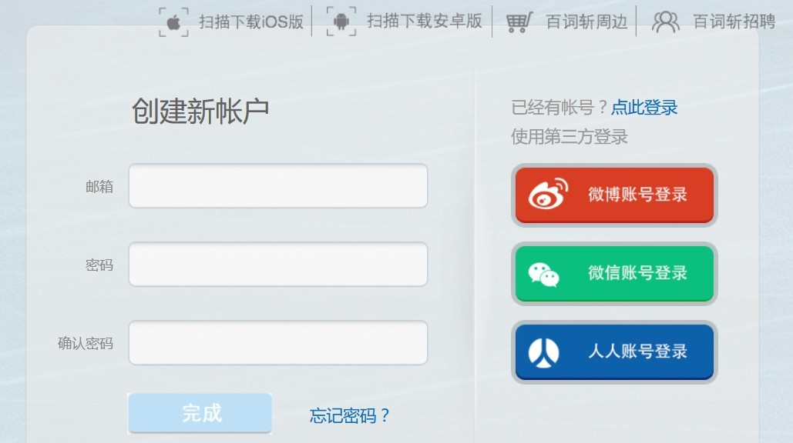

# DjangoToDo

[TOC]

# 资源
Django +python3.6 +win10 +mysql

参考的书：python web 测试驱动方法

http://www.obeythetestinggoat.com/pages/book.html#toc

https://github.com/hjwp/book-example


# 目标
我想要做什么？
Django做的一个ToDo网站。
用户登陆功能。
RestfulAPI
Swift写个iphone客户端。

发布。


# 项目进度

# 遇到的问题

## 问题1：selenuim3无法运行
最开始的测试，因为selenium3需要一个geckodriver的驱动。

https://www.zhihu.com/question/49568096

https://github.com/mozilla/geckodriver/releases

下载这个驱动，放在firefox安装目录，并且系统变量里添加firefox目录就可以了。

## 问题2：pycharm运行runserver，会有exit

Process finished with exit code -1073741819 (0xC0000005)
这个是因为run错了。
pycharm，run configuration里有Django server，而不是像之前一样的python里，添加manage。

## 问题3：Django url引用出错。

django1.10开始修改了地址引用方式。
需要直接在上面引用，然后下面是变量，而不是string

http://stackoverflow.com/questions/38744285/django-urls-error-view-must-be-a-callable-or-a-list-tuple-in-the-case-of-includ

# 总结


# 第一章 使用功能测试协助安装Django
首先需要selenium

在这里的第一步，永远是先测试，再写代码。
也就是先测试失败，然后写。
而且一次只做一步。

新建一个functional_tests.py文件。
就是用selenium开浏览器。
遇到第一个坑，需要另外的驱动。问题1解决了。

测试网址百度的话，时不时抽风，说编码错误。
google的话，因为这个不是全局翻墙，这个firefox是原始状态，打不开。

## 1.2 让Django运行起来

django-admin.py startproject TODO
这是新建项目命令
TODO文件夹里还有个TODO文件夹，里面有init，settings,urls,wsgi四个文件

书上说，manage.py应该再第二个TODO文件夹里面，不过pycharm新建的却是在外面。
测试了一下，书上的是错的。manage文件在外面，和第二个TODO文件夹平级。
pycharm还附带了sqlite

启动服务器的命令是
python manage.py runserver

这里遇到第二个坑，如果在term里，运行一点问题没有。
但是pycharm的run里运行，会exit。


# 第二章 使用unittest 模块扩展功能测试

为TODO测试文件编写个故事。

```python
from selenium import webdriver

browser = webdriver.Firefox()

# 女孩去看了网站首页
browser.get('http://localhost:8000')
# browser.get('http://sina.com')

# 女孩注意到网站标题含有To-Do
assert 'To-Do' in browser.title

# 应用邀请她输入一个待办

# 她输入了一个，买个本子

# 她输入后，页面更新了，显示了她输入的项目


# 页面又显示了一个文本框，可以输入其他待办
# 女孩输入了另一个待办

# 页面再次更新

# 显示了2个待办

# 她想知道这个网站是否会记住她的清单

# 她看到网站为她生成了一个唯一的url

# 而且页面里有文字解说这个功能

# 她访问这个URL，发现她的待办还存在

# 她很满意，去睡觉了

browser.quit()

```

出了写了个故事，还有个改变就是assert，todo字段。
这个在标题里是没有的，所以会出错。
assert是查找。

## 2.2 python标准库中的unittest模块

在这里需要重新写一份test文件

把测试写在了一个类里，unittest.TestCase的子类。
里面有setup 和teardown。
assert也换了。

## 2.3 隐式等待
setup里添加implicitly_wait
这个是要selenium等待几秒钟。
这个在简单的时候还可以，不过在复杂的时候，需要专门的等待规则。

self.browser.implicitly_wait(3)

第二章结束

# 第三章 使用单元测试，测试简单的首页

创建django应用。
django项目可以多好几个app。
python manage.py startapp lists

对比上面是project
django-admin.py startproject TODO

## 3.2 单元测试和功能测试的区别

功能测试是用户的角度，外面测试。
单元测试是程序员的角度。

顺序是，先用功能测试，再单元测试。

## 3.3 Django中的单元测试

新建的app里，直接就有个tests.py文件
里面是Django提供的TestCase这个类，是增强的unittest.testcase

启动test命令行命令是
python manage.py test
我有个问题，如果好几个app的tests，那么都test么？

运行测试的时候，测试程序会在所有以test开头的文件中查找所有的test cases(inittest.TestCase的子类),自动建立测试集然后运行测试。

注意：如果测试是基于数据库访问的(读取、查询Model)，一定要用django.test.TestCase建立测试类，而不要用unittest.TestCase。


Runing tests

```python
执行目录下所有的测试(所有的test*.py文件)：
1

$ python manage.py test

执行animals项目下tests包里的测试：
1

$ python manage.py test animals.tests

执行animals项目里的test测试：
1

$ python manage.py test animals

单独执行某个test case：
1

$ python manage.py test animals.tests.AnimalTestCase

单独执行某个测试方法：
1

$ python manage.py test animals.tests.AnimalTestCase.test_animals_can_speak

为测试文件提供路径：
1

$ python manage.py test animals/

通配测试文件名：
1

$ python manage.py test --pattern="tests_*.py"

启用warnings提醒：
1

$ python -Wall manage.py test
```

## 3.4 mvc 视图 url

django的工作方式是，http请求地址。
然后计算哪个函数处理。
相应的视图做出反应。

写个测试
使用了django内部的resolve函数，用来解析地址
这个测试当然失败。因为根本没写url解析函数嘛。

## 3.6 urls.py
url前半部分是正则表达式，后半部分是函数。
也可以用include，包含其他urls文件

这里有个问题，Django1.10修改了url引用方式，不再允许string了。
直接再上面引用模块

如果有很多视图，一个个引用不方便。
可以直接从lists import views as lists_views

## 3.7 为视图编写单元测试

```python
    def test_home_page_returns_correct_html(self):
        request = HttpRequest()
        response = home_page(request)
        self.assertTrue(response.content.startswith(b'<html>'))
        self.assertIn(b'<title>To-Do lists</title>', response.content)
        self.assertTrue(response.content.endswith(b'</html>'))

def home_page(request):
    return HttpResponse('<html><title>To-Do lists</title></html>')

```

就是，测试模块，指出用哪个函数，然后views里的函数，指出返回什么对象

第三章结束。

# 第四章 编写这些测试有什么用

在functional_tests文件里 selenium模拟的功能测试给写完。
写测试的时候，需要开启服务器。

函数里，返回html，很愚蠢，所以需要使用模板。
返回的是模板文件。

在lists/templates/home.html
写个最简单的html文件。
然后lists/views.py里
return render home.html
最后注册templates
其实并不是templates没有注册，而是，lists在项目里没有注册到。
在settings里，installed_apps里添加‘lists’

运行test测试，通过了。
再检查一下，是否返回正确html模板。
接下来测试功能测试。

写html文件。
功能测试，就写到有个table。输入项。
assert还可以自定义返回的错误信息。

第四章结束。

# 第五章 保存用户输入

首先input改成form，POST。

然后引入time.sleep(10)
可以看到forbidden，csrf。
input下面
添加一个自带的

但是这里有个问题，加了csrf后，上面的返回正确网址测试就无法通过。


## 5.2 在服务器中处理POST请求

为表单action返回主页。
先写个测试。
lists/tests.py里

然后在views里，写home_page函数。
如果要求是post，那么返回post请求里，item——text标签数据。

## 5.3 把python变量传入模板中渲染

home.html里添加new_item_text

在tests里测试的时候传入。

在views里，传入POST的参数


## 5.5 数据库迁移

先在models文件里，生成item
注意一下，这里默认字符串为空用双引号。

python manage.py makemigrations
就会出现一个migrations文件夹

## 5.9 使用迁移创建生产数据库

test是django生成的测试数据库。
真正的数据库，要自己创建
在settings里设置Database
默认是sqlite3

在这里有个问题，如果用python manage.py shell启动试一下，
会发现Error loading MySQLdb module: No module named 'MySQLdb'

这是因为mysqldb并不兼容于python3

https://docs.djangoproject.com/en/1.10/ref/databases/#mysql-notes

这里的文档，给出了3个选项。
反正都是第一次，我都试一下吧。

http://www.jianshu.com/p/ecc941e861ee

### mysqlclient
这个是django官方推荐的做法。
首先pip install 之后 弹出错误，说需要c++ build tools
http://landinghub.visualstudio.com/visual-cpp-build-tools

那就装吧。

还是遇到很多问题，放弃了，算了。

### 试一下pymysql来代替

因为之前就是用这个链接的。
pip install pymysql
然后在init文件里。

```python
import pymysql
pymysql.install_as_MySQLdb()
```

就可以了。python manage.py shell 试一下。

发现可以了。
那么python manage.py migrate


```python
DATABASES = {
    'default': {
        # 'ENGINE': 'django.db.backends.sqlite3',
        'ENGINE': 'django.db.backends.mysql',
        # 'NAME': os.path.join(BASE_DIR, 'db.sqlite3'),
        'NAME': 'django_todo',
        'USER': 'root',
        'PASSWORD': 'password',  ## 安装 mysql 数据库时，输入的 root 用户的密码
        'HOST': '127.0.0.1',
        'PORT': '3306',
    }
}
```
forloop.counter，这个可以按照循环次数，增加1，2，3.。。


第五章结束，实际上，我放弃了从5.3开始跟踪tdd了。
因为实在是太繁琐了。

# 第六章 完成最简可用的网站

这一章需要做的是用户自己的清单列表是唯一的。
不过暂时还没用到用户管理机制。

以后要做注册页面。
但是需要第三方登录。
比如百词斩 官网

http://www.baicizhan.com/register



先做个view 地址唯一的。

先去views.py修改函数

然后去url定义地址

最后修改模板

修改模板了，当然views里制定的html也要改变

下一步要做新建页面

1. views里，新建一个pass的 new_list函数
2. url里，进行地址引用-这里有个捕获组概念（）包起来才可以
3. 返回views里，修改完new_list函数
4. 修改html表单

接下来要修改model。
新建一个list对象。
一个list，对好几个items对象。
要设置外键。一不用管，多要设置。
新建了，所以要make migrations
views里new_list也要修改

接下来，每个列表都应该有自己的url
要做的就是捕获url-正则表达式
